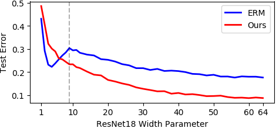
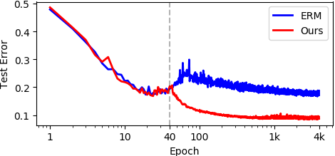
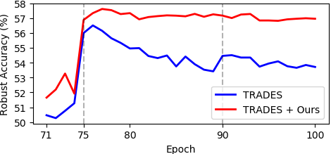

# Self-Adaptive Training
This is the PyTorch implementation of the 
- NeurIPS'2020 paper [Self-Adaptive Training: beyond Empirical Risk Minimization](https://arxiv.org/abs/2002.10319)，
- the journal version [Self-Adaptive Training: Bridging the Supervised and Self-Supervised Learning](https://arxiv.org/abs/2101.08732).


Self-adaptive training significantly improves the generalization of deep networks under noise and enhances the self-supervised representation learning. It also advances the state-of-the-art on *learning with noisy label*, *adversarial training* and the *linear evaluation* on the learned representation.

## News
- 2021.01: We have released the journal version of Self-Adaptive Training, which is a unified algorithm for both the supervised and self-supervised learning. Code for self-supervised learning will be available soon.
- 2020.09: Our work has been accepted at NeurIPS'2020.

## Requirements

- Python >= 3.6
- PyTorch >= 1.0
- CUDA
- Numpy

## Usage
### Standard training
The `main.py` contains training and evaluation functions in standard training setting.
#### Runnable scripts
- Training and evaluation using the default parameters
  
  We provide our training scripts in directory `scripts/`. For a concrete example, we can use the command as below to train the default model (i.e., ResNet-34) on CIFAR10 dataset with uniform label noise injected (e.g., 40%):
  ```bash
  $ bash scripts/cifar10/run_sat.sh [TRIAL_NAME]
  ```
  The argument `TRIAL_NAME` is optional, it helps us to identify different trials of the same experiments without modifying the training script. The evaluation is automatically performed when training is finished.

- Additional arguments
  - `noise-rate`: the percentage of data that being corrupted
  - `noise-type`: type of random corruptions (i.e., corrupted_label, Gaussian,random_pixel, shuffled_pixel)
  - `sat-es`: initial epochs of our approach
  - `sat-alpha`: the momentum term $\alpha$ of our approach
  - `arch`: the architecture of backbone model, e.g., resnet34/wrn34


#### Results on CIFAR datasets under uniform label noise
- Test Accuracy(%) on CIFAR10

|Noise Rate         |0.2    |0.4    |0.6    |0.8    |
|-------------------|-------|-------|-------|-------|
|ResNet-34          |94.14  | 92.64 |89.23  |78.58  |
|WRN-28-10          |94.84  | 93.23 |89.42  |80.13  |


- Test Accuracy(%) on CIFA100

|Noise Rate         |0.2    |0.4    |0.6    |0.8    |
|-------------------|-------|-------|-------|-------|
|ResNet-34          |75.77  |71.38  |62.69  |38.72  |
|WRN-28-10          |77.71  | 72.60 |64.87  |44.17  |


#### Runnable scripts for repreducing double-descent phenomenon
You can use the command as below to train the default model (i.e., ResNet-18) on CIFAR10 dataset with 16.67% uniform label noise injected (i.e., 15% label *error* rate):
  ```bash
  $ bash scripts/cifar10/run_sat_dd_parallel.sh [TRIAL_NAME]
  $ bash scripts/cifar10/run_ce_dd_parallel.sh [TRIAL_NAME]
  ```


#### Double-descent ERM vs. single-descent self-adaptive training
<p align="center">
    
</p>
<p align="center">
Double-descent ERM vs. single-descent self-adaptive training on the error-capacity curve. The vertical dashed line represents the interpolation threshold.
</p>

<p align="center">
    
</p>
<p align="center">
Double-descent ERM vs. single-descent self-adaptive training on the epoch-capacity curve. The dashed vertical line represents the initial epoch E_s of our approach.
</p>


### Adversarial training
We use state-of-the-art adversarial training algorithm [TRADES](https://github.com/yaodongyu/TRADES) as our baseline. The `main_adv.py` contains training and evaluation functions in adversarial training setting on CIFAR10 dataset.

#### Training scripts
- Training and evaluation using the default parameters
  
  We provides our training scripts in directory `scripts/cifar10`. For a concrete example, we can use the command as below to train the default model (i.e., WRN34-10) on CIFAR10 dataset with PGD-10 attack ($\epsilon$=0.031) to generate adversarial examples:
  ```bash
  $ bash scripts/cifar10/run_trades_sat.sh [TRIAL_NAME]
  ```

- Additional arguments 
  - `beta`: hyper-parameter $1/\lambda$ in TRADES that controls the trade-off between natural accuracy and adversarial robustness
  - `sat-es`: initial epochs of our approach
  - `sat-alpha`: the momentum term $\alpha$ of our approach

#### Robust evaluation script
Evaluate robust WRN-34-10 models on CIFAR10 under PGD-20 attack:
```bash
  $ python pgd_attack.py --model-dir "/path/to/checkpoints"
```
This command evaluates 71-st to 100-th checkpoints in the specified path.

#### Results
<p align="center">
    
</p>
<p align="center">
Self-Adaptive Training mitigates the overfitting issue and consistently improves TRADES.
</p>

#### Attack TRADES+SAT
We provide the checkpoint of our best performed model in [Google Drive](https://drive.google.com/file/d/1yX9kVmqxImGQAckSOtlAImarRnZ30nMt/view?usp=sharing) and compare its natural and robust accuracy with [TRADES](https://github.com/yaodongyu/TRADES) as below.
|Attack (submitted by) \ Method|TRADES|TRADES + SAT|
|------------------------------|:----:|:----------:|
|None (initial entry)          |84.92 |83.48       |
|PGD-20 (initial entry)        |56.68 |58.03       |
|[MultiTargeted-2000](https://arxiv.org/abs/1910.09338) (initial entry)|53.24 |53.46       |
|[Auto-Attack+](https://github.com/fra31/auto-attack) (Francesco Croce)|53.08 |53.29       |


## Reference
For technical details, please check [the conference version](https://arxiv.org/abs/2002.10319) or [the journal version](https://arxiv.org/abs/2101.08732) of our paper.

```
@inproceedings{huang2020self,
  title={Self-Adaptive Training: beyond Empirical Risk Minimization},
  author={Huang, Lang and Zhang, Chao and Zhang, Hongyang},
  booktitle={Advances in Neural Information Processing Systems},
  volume={33},
  year={2020}
}

@article{huang2021self,
  title={Self-Adaptive Training: Bridging the Supervised and Self-Supervised Learning},
  author={Huang, Lang and Zhang, Chao and Zhang, Hongyang},
  journal={arXiv preprint arXiv:2101.08732},
  year={2021}
}
```

## Contact
If you have any question about this code, feel free to open an issue or contact laynehuang@pku.edu.cn.
